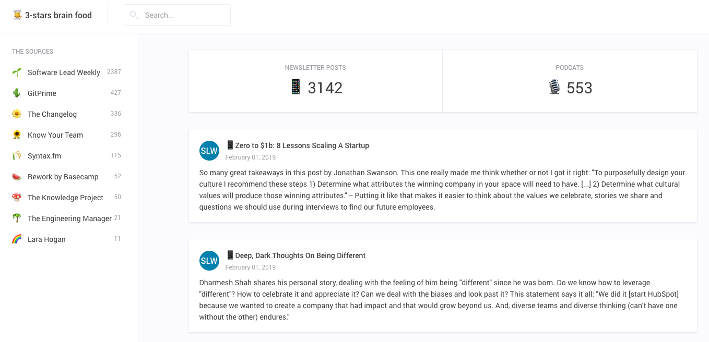

# 3 Stars

> 3 stars brain food


## 🏗️ Installation

```
❯ git clone git@github.com:92bondstreet/3-stars.git
❯ yarn
```

## [Live demo](https://3-stars.now.sh/)




## 🕹️ Usage

### Parse all issues and index them into algolia

```sh
# defining .env file with ALGOLIA_APPLICATION_ID, ALGOLIA_API_KEY
❯ make parse
```

### Start react app (based on [Algolia React InstantSearch](https://www.algolia.com/doc/guides/building-search-ui/what-is-instantsearch/react/) ) sandbox

```sh
❯ make sandbox
```

## 🚀 Deploy


```sh
❯ make deploy
```

## 🌱 Inspiration - deep dive reading

* [Newsletters, Podcasts, Indie news... to feed my brain](https://github.com/92bondstreet/brain-food)
